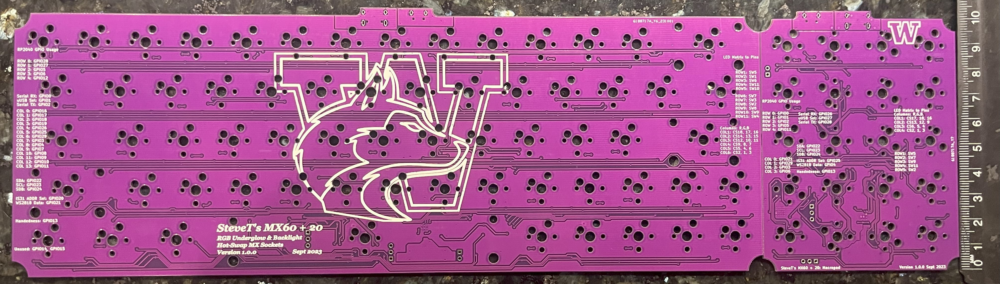
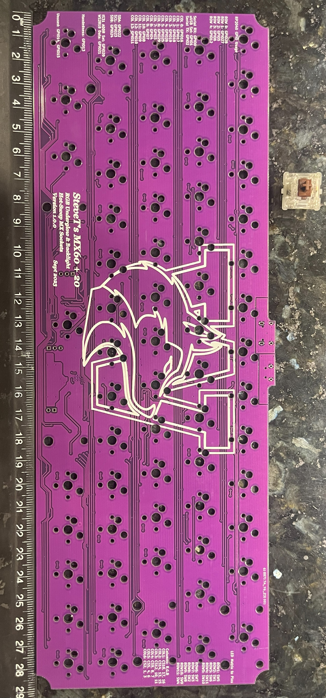
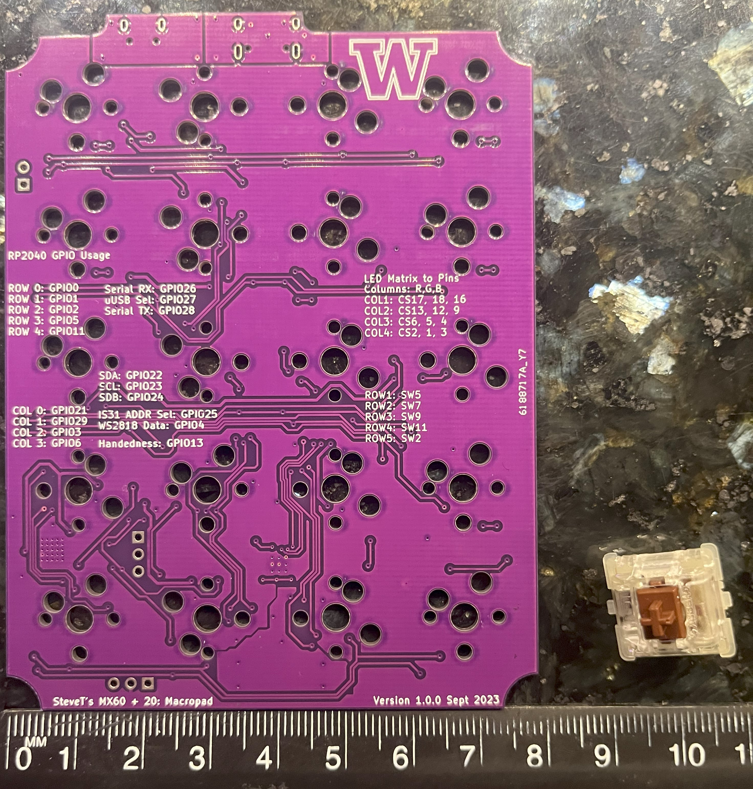
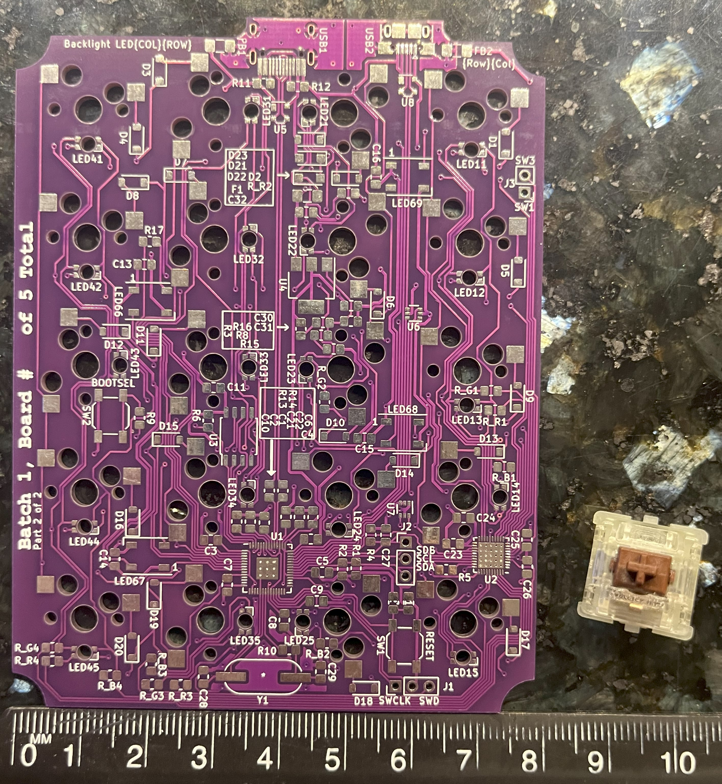

# MX60 + 20

The MX60 + 20 is a 60% keyboard PCB that features Hot-Swappable MX Switches, RGB underglow, RGB backlighting, and a dettachable 4x5 macropad via micro-usb male to male. The hardware was designed in Kicad by myself and uses QMK firwmare.

## Design Specifications:
Main body:
- Modified ANSI 60% layout
    - Shrank 2.25u shift down to 2u shift key.
    - Extra 1u key added on second to bottom row.
    - 64 Keys total.
- 8 WS2812 ARGBs for underglow
- 64 RGB Backlights
- USB-C Connecter to PC.
- Micro-USB Connecter to macropad.
- 288.8 mm by 104 mm PCB size.
- 2 Layer PCB

Front side of main body PCB.

Back side of main body PCB.

Macropad:
- 4x5 layout
    - 20 keys total.
- 4 WS2812 ARGBs for underglow.
- 20 RGB backlights.
- USB-C Connecter to PC.
- Micro-USB Connecter to main body.
- 79 mm by 104 mm PCB size.
- 2 Layer PCB

Front side of macro pad PCB.

Back side of macro pad PCB.

## Goal
This project's overall goal is to act as a progressive learning project that complements my education in Computer Engineering. The first goal of this project was to familiarize myself with hardware design, where I would learn: 
- How to design circuit schematics and PCB layout in EDA software, specifically KiCad.
- How to use 3D printers and CAD software to design keycaps and cases
- How to use tools such reflow ovens, stencils, and soldering paste to assemble electronics.

After verifying my hardware design and solving any potential issues, I would move onto the second goal of this project which is learn more about firmware, more specifically:

- How to program C/Assembly in ARM-based MCU.
- How communication protocals such as I2C are implemented.
- More to come! (As I have not gotten to this stage yet)

## Creating Gerbers
Most PCB fabrication places expect gerber files. Gerber files describe the layout of pads, traces, drill holes, and other geometry for each layer on the PCB. Gerber files should be uploaded in a compress zip file containing all layers. To create gerber files in KiCad v7.0:

1. Open KiCad's PCB viewer
2. Go to `File` -> `Plot`
3. Select layers and options accordingly to your fabrication shop's settings. I chose JLCPCB so I set the following options below and set all others to unchecked.
    * Include Layers:
        * F.Cu
        * B.Cu
        * F.Paste
        * B.Paste
        * F.Silkscreen
        * B.Silkscreen
        * F.Mask
        * B.Mask
        * Edge.cuts
    * `Plot reference designators`
    * `Plot footprint values`
    * `Use Protel filename extensions`
    * `Subtract soldermask from silkscreen`
    * Check zone fills before plotting.
4. Set the output directory to `project-name-gerbers`, where project name is a placeholder.
5. Click `Plot` to generate layer gerbers.
6. Click `Generate Drill files...`
7. Again, select options that match with your fabrication shop's specifications. For JLCPCB, this is:
    * Drill File Format set to Excellon.
    * Oval Holes Drill Mode is set to `Use alternate drill mode`
    * Map File Format set to `Gerber`
    * Drill Origin set to `Absolute`
    * Drill units set to `Millimeters`
    * Zeros format set to `Decimal format`
8. Click `Generate Drill File`
9. Zip up your gerber files and now it is ready for upload.